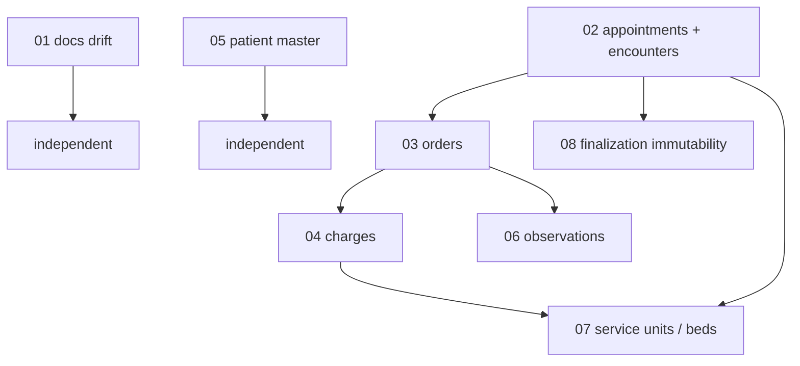

# Improvement proposals

Proposals derived from the reference-architecture research
([docs/research/01-reference-architecture-danphe-marley.md](../research/01-reference-architecture-danphe-marley.md)),
written for **owner review before any implementation**. Nothing here is settled: each doc ends
in numbered decision points with options and a recommendation, and every schema sketch is a
direction to judge, not a migration to run.

## How to review

1. Read in the suggested order below (dependencies flow downward).
2. For each decision point, note your call — accepting the recommendation is a call too.
3. Flip the doc's `Status:` line when you're done with it:
   - `APPROVED — decisions recorded` (implementation may be specced),
   - `APPROVED WITH CHANGES — see decision points`,
   - `REJECTED — <one line why>`, or
   - `DEFERRED — revisit after <event>`.
4. Approved docs feed the normal pipeline: `spec` → `org-scoped-feature` skill →
   implementation. A proposal here never authorizes a build by itself.

## Suggested review order

| Doc                                               | Proposal                                                                                 | Depends on                      | Stage                                                        |
| ------------------------------------------------- | ---------------------------------------------------------------------------------------- | ------------------------------- | ------------------------------------------------------------ |
| [01](./01-docs-drift-fixes.md)                    | Documentation drift fixes (project intent, `/ai` ADR, domain architecture page, MRN ADR) | none                            | now — pure hygiene                                           |
| [05](./05-patient-master-additions.md)            | Patient master additions (status, blood group, allergies, uid)                           | none                            | now — additive migration                                     |
| [02](./02-appointments-encounters.md)             | Appointments + encounters, status machines                                               | none                            | next domain — sets naming and lifecycle for everything below |
| [03](./03-orders.md)                              | One generic orders table                                                                 | 02                              | after 02                                                     |
| [04](./04-charges-billing.md)                     | First-class charge rows, snapshot pricing                                                | 02, 03                          | after 03                                                     |
| [08](./08-encounter-finalization-immutability.md) | Finalization = clinical immutability + in-transaction audit                              | 02 (touches 03/04/06 contracts) | with 02–04                                                   |
| [06](./06-observations-lab.md)                    | Template-driven typed observations                                                       | 03                              | later — directional, when lab lands                          |
| [07](./07-service-units-beds.md)                  | Service-unit tree, beds, occupancy                                                       | 02, 04                          | later — directional, when IPD lands                          |

## Cross-doc contracts (shared working assumptions)

- Working table names: `appointments`, `encounters`, `orders`, `charges`, `observations`,
  `service_units`, `occupancies`. The visit-vs-encounter naming call is owned by doc 02;
  a rename there cascades through 03–08.
- The catalog (`catalog_items`) is the single chargeable-item registry: orders and charges
  reference `catalogItemId`; charges snapshot price/tax at charge time.
- Charges are polymorphic over producers via `sourceType`/`sourceId` (consultation, order,
  occupancy, manual).
- All new tables follow the hard rules: `orgId NOT NULL`, tenant predicate on every query,
  `orgProcedure(permission, input)`, permissions only in `packages/auth/src/access.ts`.
  Audit is fire-and-forget `audit()` per the settled 2026-08-07 decision; proposals that
  assumed in-transaction audit were deferred or amended in review (see decision log).

## Decision log

Record outcomes here as docs get reviewed, newest first.

| Date       | Doc | Outcome                                                                                                                        |
| ---------- | --- | ------------------------------------------------------------------------------------------------------------------------------ |
| 2026-08-07 | 01  | APPROVED — recommendations accepted as written; docs-only pass scheduled                                                       |
| 2026-08-07 | 05  | APPROVED WITH CHANGES — all additive columns except `status`; sex gains `unknown`; audit stays fire-and-forget                 |
| 2026-08-07 | 02  | DEFERRED — revisit after pilot feedback; v0 keeps `visits` + walk-in queue; appointments can later reference visits additively |
| 2026-08-07 | 03  | DEFERRED — Slice 7 keeps note-child orders; carries over denormalized `category` and expected-state cancel predicate           |
| 2026-08-07 | 04  | REJECTED — superseded by spec Slices 5–6 (snapshot charges, one-transaction issuance already settled there)                    |
| 2026-08-07 | 08  | DEFERRED — revisit with 02; requires in-transaction audit, contradicting the settled audit decision                            |
| 2026-08-07 | 06  | DEFERRED — lab result entry out of v0 scope                                                                                    |
| 2026-08-07 | 07  | DEFERRED — IPD/beds out of v0 scope                                                                                            |
